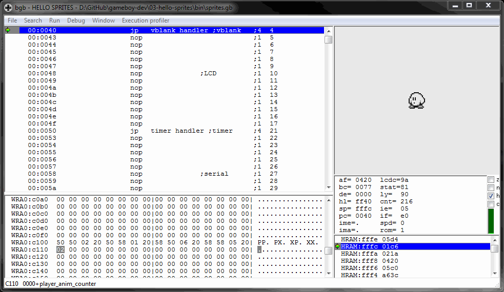

# Hello Sprites
A Game Boy ROM that displays an animated sprite by running a sprite DMA transfer every frame during vsync and updating the sprite data from a timer interrupt.

Resources on sprite memory:
* https://exez.in/gameboy-dma
* https://fms.komkon.org/GameBoy/Tech/Software.html

Compile by running `make` from this directory.

