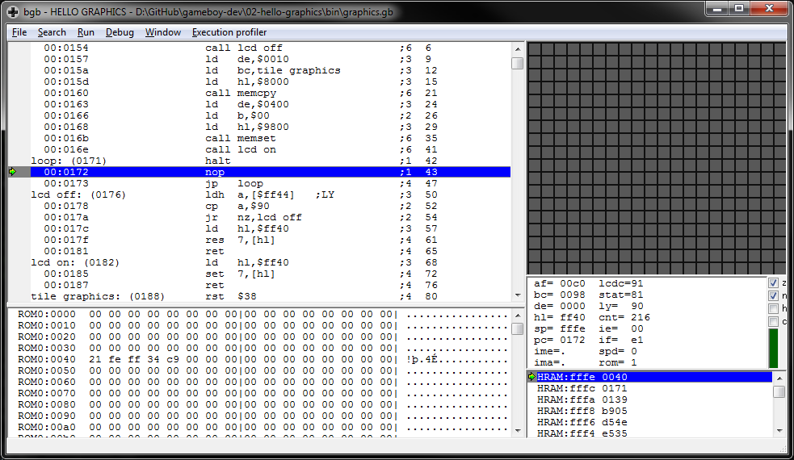
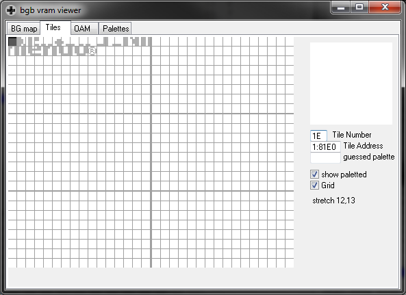
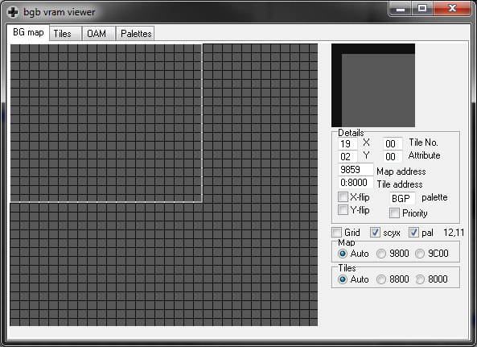

# Hello Graphics
A Game Boy ROM that displays a scrolling checkerboard pattern by overwriting tile #0 in VRAM, clearing out the background tile table, and incrementing the X and Y scroll registers each frame during vblank.

Compile by running `make` from this directory.

