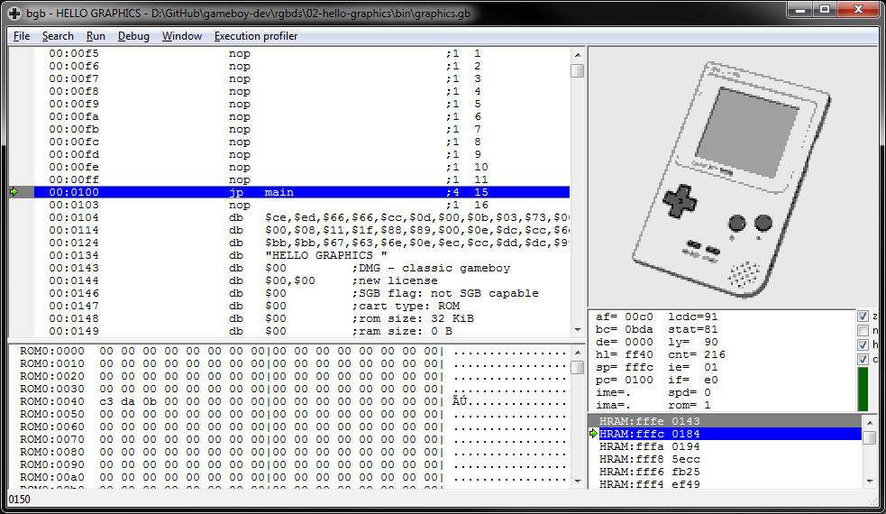
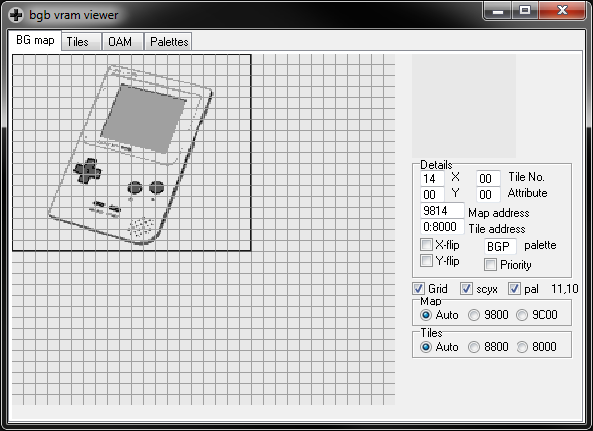
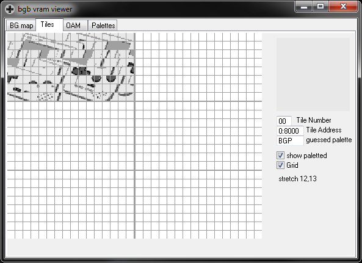

# Hello Graphics
A Game Boy ROM that displays a background image processed from a .png by [`rgbgfx`](https://rednex.github.io/rgbds/rgbgfx.1.html). You can produce suitable .pngs using a utility I wrote called [`gbgfx`](https://github.com/taylus/gameboy-graphics).

Compile by running `make` from this directory.

