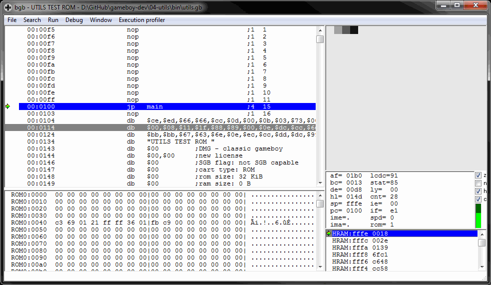

# Utilities
A Game Boy ROM that demonstrates some generic code and concepts not present in previous examples.

* Generic makefiles you don't need to update each time you add a new source file
* Debug messages and source code breakpoints (in bgb)
* Tile coordinate functions for single-screen games
* Using the standard `hardware.inc`

Compile by running `make` from this directory.

