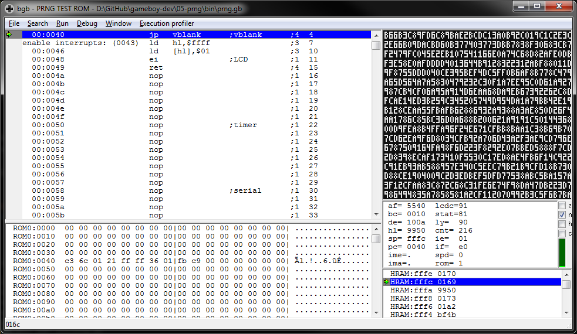

# PRNG
A Game Boy ROM that generates and fills the screen with (pseudo)random numbers.

Implemented using a linear feedback shift register adapted from code for the NES.

References:
* https://wiki.nesdev.com/w/index.php/Random_number_generator
* https://github.com/taylus/nes-dev/tree/master/12-prng