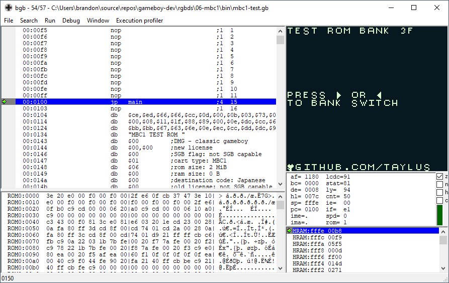

# MBC1 Test ROM

A Game Boy ROM that demonstrates bank switching using the MBC1 memory bank controller. This was the most commonly used MBC during the first few years of Game Boy games. [[1]](https://mgba-emu.github.io/gbdoc/#mbc1)

References:

* <https://b13rg.github.io/Gameboy-Bank-Switching/>
* <https://gekkio.fi/blog/2015/mooneye-gb-gameboy-cartridge-types/>
* <https://gbdev.io/pandocs/#mbc1>
